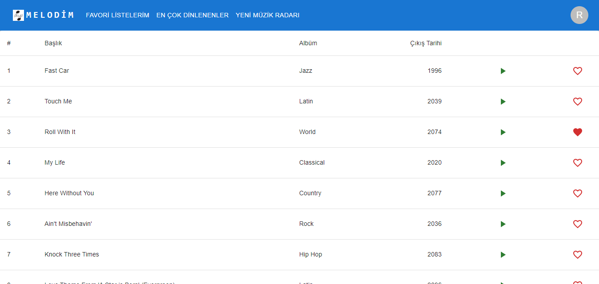
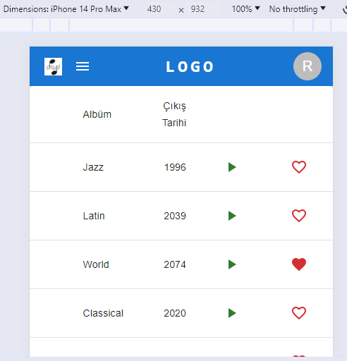

# React + TypeScript + Vite

This template provides a minimal setup to get React working in Vite with HMR and some ESLint rules.
# Melodim
Müzik Listesi

## Kurulum

1. Projeyi klonlayın: `git clone https://github.com/muratcanclb/melodim.ui.git`
2. Proje dizinine gidin: `cd proje`
3. Bağımlılıkları yükleyin: `npm install`

MATERAL-UI ---> Responsive Bar Add
|  |  |